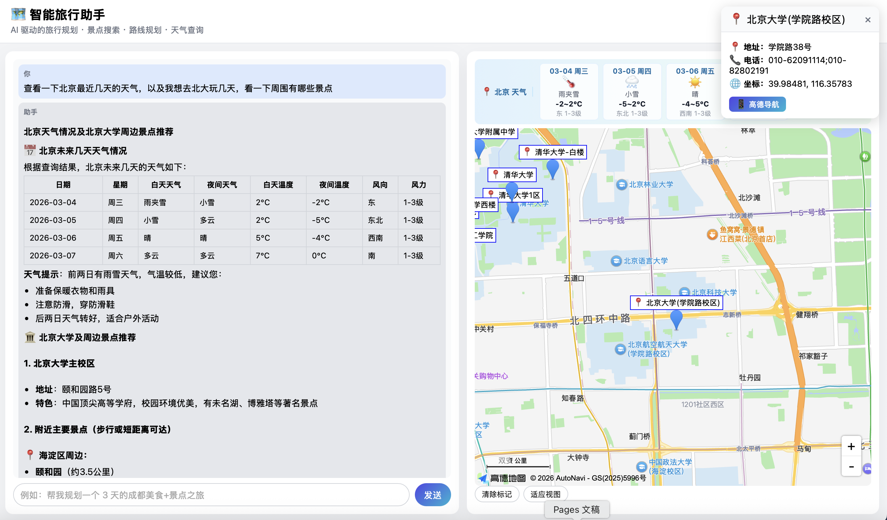
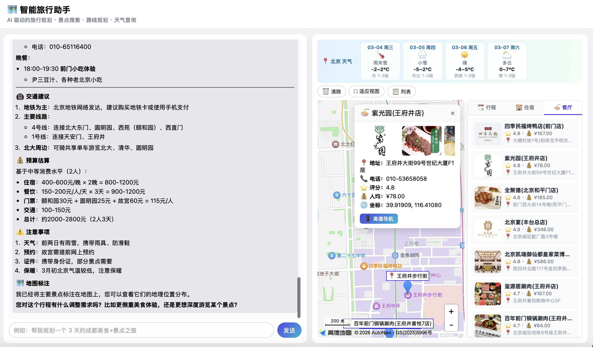
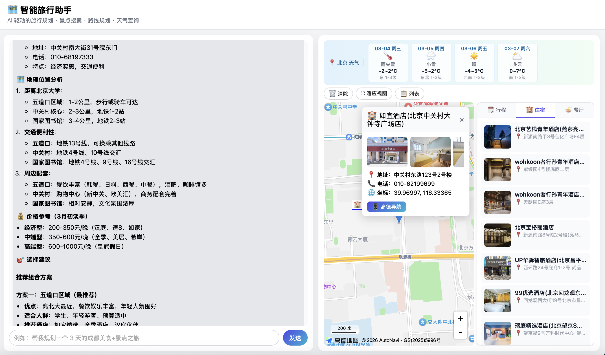

# 🗺️ Travel Agent — AI 旅行规划助手

基于 **LangGraph ReAct** 架构的多工具旅行规划 Agent，集成高德地图 API，支持自然语言对话式行程规划、POI 搜索、路线规划、天气查询、预算估算，并在前端实时渲染交互地图。

> 本项目的整体架构（Agent 编排、工具节点体系、配置中心、Skills 扩展机制等）基于 [FireRed-OpenStoryline](https://github.com/FireRedTeam/FireRed-OpenStoryline) 开源框架搭建，并在此基础上针对旅行场景进行了定制开发。

---

## ✨ 功能特性

| 功能 | 说明 |
|------|------|
| 🔍 **POI 搜索** | 基于高德地图搜索景点、餐厅、酒店 |
| 🏨 **酒店推荐** | 按区域、价位、评分筛选住宿选项 |
| 🍜 **餐厅搜索** | 按菜系、位置搜索周边餐厅 |
| 🧭 **智能行程规划** | K-means 地理聚类 + 节奏控制，自动按天分组 |
| 🗓️ **行程格式化** | 生成结构化每日行程，支持雨天备选方案 |
| 🛣️ **路线规划** | 步行 / 驾车 / 公交路线，含时间与距离 |
| 🚆 **交通建议** | 城市间交通方式推荐 |
| ☁️ **天气查询** | 接入高德天气 API，支持预测 |
| 💰 **预算估算** | 按人数、天数、消费习惯估算旅行花费 |
| 🗺️ **地图渲染** | 前端实时渲染 POI 标记 + 路线轨迹 |
| 📋 **行程渲染** | 可视化每日行程卡片 |
| 💬 **对话历史** | localStorage 持久化聊天记录 |

---

## 📸 效果展示

<p align="center">
  
  <br><em>对话界面与高德地图实时渲染</em>
</p>

<p align="center">
  
  <br><em>餐厅展示</em>
</p>

<p align="center">
  
  <br><em>住宿展示</em>
</p>

---

## 🏗️ 技术架构

```
┌─────────────────────────────────────────┐
│         浏览器  (index.html / app.js)    │
│  ┌──────────────┐  ┌───────────────────┐│
│  │  对话界面     │  │  高德 JS API 地图  ││
│  └──────┬───────┘  └─────────┬─────────┘│
└─────────│───────────────────│──────────┘
          │ HTTP SSE / REST    │ AMap JS SDK
┌─────────▼────────────────────────────────┐
│           FastAPI  (agent_fastapi.py)    │
│  ┌────────────────────────────────────┐  │
│  │   LangGraph ReAct Agent           │  │
│  │   ┌──────────┐  ┌──────────────┐  │  │
│  │   │ DeepSeek │  │  Tool Nodes  │  │  │
│  │   │ Chat LLM │  │  (14 tools)  │  │  │
│  │   └──────────┘  └──────┬───────┘  │  │
│  └───────────────────────│───────────┘  │
└────────────────────────── │──────────────┘
                            │ REST
              ┌─────────────▼─────────────┐
              │    高德地图 REST API        │
              │  POI / 路线 / 天气 / Geocode│
              └───────────────────────────┘
```

- **后端**：Python 3.11 · FastAPI · LangGraph · LangChain
- **LLM**：DeepSeek Chat（通过 OpenAI 兼容接口）
- **地图**：高德地图 Web 服务 API（后端）+ JS API v2（前端）
- **包管理**：[uv](https://docs.astral.sh/uv/)

---

## 📦 目录结构

```
travel/
├── agent_fastapi.py          # FastAPI 服务入口
├── cli.py                    # 命令行交互入口
├── config.toml               # ⚠️ 含 API Key，已加入 .gitignore，请勿提交
├── config.toml.example       # 配置模板，复制此文件并填写 Key
├── requirements.txt          # 依赖列表
├── src/
│   └── travel_agent/
│       ├── agent.py          # Agent 构建 & 工具注册
│       ├── config.py         # Pydantic 配置加载
│       ├── nodes/
│       │   └── core_nodes/   # 14 个工具节点
│       │       ├── search_poi.py
│       │       ├── plan_itinerary.py
│       │       ├── smart_plan_itinerary.py
│       │       ├── plan_route.py
│       │       ├── search_hotel.py
│       │       ├── search_restaurant.py
│       │       ├── check_weather.py
│       │       ├── estimate_budget.py
│       │       ├── recommend_transport.py
│       │       ├── format_itinerary.py
│       │       ├── render_map.py
│       │       ├── render_itinerary.py
│       │       └── json_tools.py
│       └── utils/
│           ├── prompts.py    # 系统提示词
│           └── logging.py
└── web/
    ├── index.html            # 前端页面（⚠️ 需填写 jsapi_key）
    └── static/
        ├── app.js            # 地图交互 & 聊天逻辑
        └── style.css
```

---

## 🚀 快速开始

### 前置条件

- Python **3.11+**
- [uv](https://docs.astral.sh/uv/) 包管理器（`pip install uv` 或 `brew install uv`）
- [DeepSeek 平台](https://platform.deepseek.com/) API Key
- [高德开放平台](https://lbs.amap.com/) 应用（需创建两种 Key，见下文）

---

### 1. 申请 API Key

**DeepSeek**：前往 [platform.deepseek.com](https://platform.deepseek.com/) → API Keys → 创建。

**高德地图**（需两个不同类型的 Key）：

1. 登录 [高德开放平台控制台](https://console.amap.com/dev/key/app)
2. 创建应用，添加 **Web服务** 类型 Key → 用于后端 REST 接口（POI 搜索 / 路线规划 / 天气）
3. 在同一应用下添加 **Web端（JS API）** 类型 Key → 用于前端地图渲染

---

### 2. 配置文件

```bash
cp config.toml.example config.toml
```

编辑 `config.toml`，填入你的 Key：

```toml
[llm]
api_key = "sk-xxxxxxxxxxxxxxxxxxxx"   # DeepSeek API Key

[map]
api_key = "xxxxxxxxxxxxxxxxxxxxxxxxxxxxxxxx"   # 高德 Web服务 Key
jsapi_key = "xxxxxxxxxxxxxxxxxxxxxxxxxxxxxxxx" # 高德 JS API Key

[weather]
api_key = "xxxxxxxxxxxxxxxxxxxxxxxxxxxxxxxx"   # 同 map.api_key（共用 Web服务 Key）
```

> ⚠️ **还需要**：打开 `web/index.html`，将 `<script src>` 标签中的 `YOUR_AMAP_JSAPI_KEY` 替换为你的 JS API Key：
> ```html
> src="https://webapi.amap.com/maps?v=2.0&key=你的jsapi_key"
> ```

---

### 3. 安装依赖

```bash
uv venv .venv
uv pip install -r requirements.txt
```

---

### 4. 启动服务

```bash
uv run uvicorn agent_fastapi:app --host 127.0.0.1 --port 8000 --reload
```

打开浏览器访问 **[http://localhost:8000](http://localhost:8000)**，即可开始对话规划行程。

---

## 💡 使用示例

```
帮我规划一个成都 3 天 2 晚的旅行，预算 2000 元，喜欢美食和历史文化
```

```
从宽窄巷子到武侯祠怎么走？步行需要多久？
```

```
帮我查查明天成都的天气，顺便推荐几家附近的特色火锅
```

---

## ⚙️ CLI 模式

不启动 Web 服务时，也可以直接命令行对话：

```bash
uv run python cli.py
```

---

## 📝 License

MIT License
